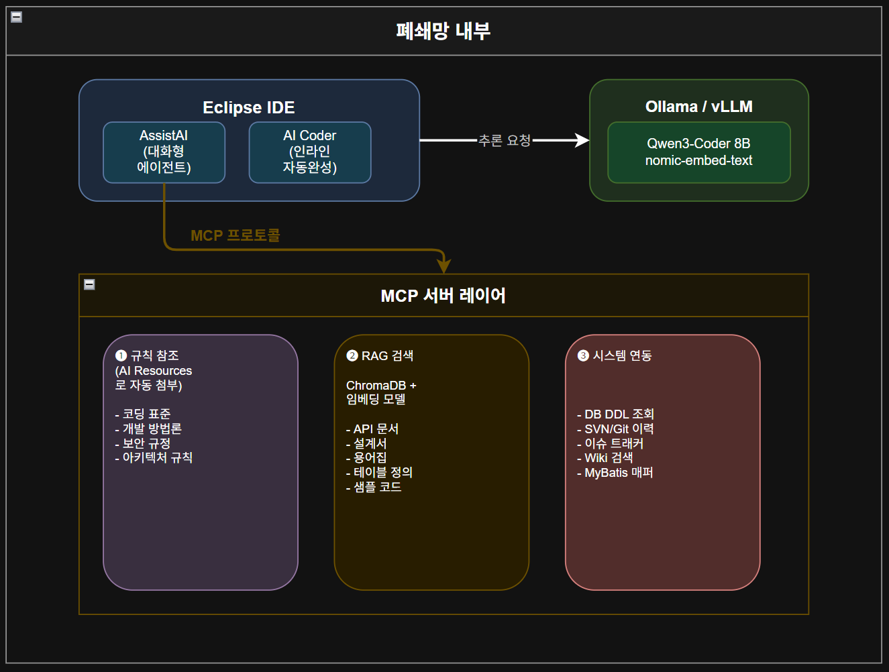

  

개발자: "계좌 해지 서비스를 만들어줘. TB_ACCT_MST 테이블의 
        ACCT_STAT_CD를 '90'(해지)로 변경하고, 해지 이력을 
        TB_ACCT_CLOSE_HST에 등록해야 해."

AI 내부 동작:
  1. [규칙 참조] 시스템 프롬프트에서 레이어 구조, 네이밍 규칙 확인
  2. [RAG 검색] search_cbanks_docs("계좌 해지 서비스 패턴") 호출
     → 기존 유사 업무 코드와 설계 패턴 반환
  3. [RAG 검색] search_table_spec("TB_ACCT_MST") 호출
     → 테이블 컬럼 정의 반환
  4. [RAG 검색] search_table_spec("TB_ACCT_CLOSE_HST") 호출
     → 이력 테이블 구조 반환
  5. 위 컨텍스트를 종합하여 C-Banks 규정에 맞는 코드 생성:
     - AcctCloseController.java
     - AcctCloseService.java / AcctCloseServiceImpl.java
     - AcctCloseDao.java
     - AcctCloseVO.java
     - ACCT_CLOSE.xml (MyBatis 매퍼)
     - AcctCloseServiceTest.java (JUnit)
