# 🏦 DART 기반 기업여신 심사 자동화 워크플로우

> **BNK 부산은행 IT기획부 AI인프라팀**  
> DART 공시 API + Dify Workflow 기반 지점장용 기업여신 심사 자동화

---
<div align="center">
  
</div>

## 개요

영업점 지점장이 기업 대출 심사 시 활용하는 **여신심사 의견서를 자동 생성**하는 Dify 워크플로우 DSL입니다.

DART 오픈API에서 3개년 재무데이터를 수집하고, Python 코드로 핵심 심사지표를 계산한 뒤, LLM이 구조화된 여신심사 의견서를 생성합니다.

---

## 아키텍처

```
시작 (입력)
  │  기업명 / 대출금액 / 목적 / 기준연도 / 담당자
  ▼
① HTTP: DART 기업코드 조회 (company.json)
  │  → corp_code 확보
  ▼
② CODE: corp_code 추출 + 날짜 계산
  │  → bgn_de / end_de (기준연도 기준 3개년 범위)
  ▼
③ HTTP: 3개년 재무제표 수집 (fnlttSinglAcntAll)
  │  → 당기 / 전기 / 전전기 1회 호출로 동시 수집
  ▼
④ HTTP: 주요재무지표 수집 (fnlttSinglIndx)
  │  → DART 사전계산 비율값 (ICR·부채비율·유동비율 등)
  ▼
⑤ HTTP: 최근 공시목록 수집 (list.json)
  │  → 감사의견 한정/부적정, 횡령·배임 등 이상공시 탐지
  ▼
⑥ CODE: 심사지표 종합 계산 (Python)
  │  → ICR, EBITDA, 차입금의존도, A~E 등급, RED/YELLOW 신호
  ▼
⑦ LLM: AI 여신심사 의견서 생성
  │  → 8개 섹션 구조화 리포트
  ▼
출력: 의견서 / 여신등급 / 위험신호
```

---

## 활용 DART API 목록

| API | Endpoint | 용도 |
|-----|----------|------|
| 기업개황 | `company.json` | 기업명 → corp_code 변환 |
| 단일회사 전체재무제표 | `fnlttSinglAcntAll.json` | **3개년 재무제표 1회 수집** (thstrm/frmtrm/bfefrmtrm) |
| 주요재무지표 | `fnlttSinglIndx.json` | DART 사전계산 비율값 (ICR·부채비율 등) |
| 공시검색 | `list.json` | 최근 공시목록, 이상공시 탐지 |

> **핵심 설계 포인트**: `fnlttSinglAcntAll`은 1회 호출로 당기(`thstrm_amount`) / 전기(`frmtrm_amount`) / 전전기(`bfefrmtrm_amount`) 3개년 데이터를 동시 제공합니다.

---

## 심사지표 계산 로직

### 수집 계정과목

| 계정 | 용도 |
|------|------|
| 매출액 | 3개년 성장성 분석 |
| 영업이익 | ICR 계산, 수익성 평가 |
| 이자비용 | ICR 분모 |
| 당기순이익 | 3개년 수익성 추이 |
| 감가상각비 | EBITDA 계산 |
| 자산/부채/자본총계 | 안정성 지표 |
| 유동자산/유동부채 | 유동비율 |
| 단기차입금/장기차입금/사채 | 총차입금 → 차입금의존도 |

### 핵심 심사지표

```
이자보상배율(ICR) = 영업이익 / 이자비용
                   (DART fnlttSinglIndx 사전계산값 우선 사용)

EBITDA           = 영업이익 + 감가상각비

차입금의존도      = 총차입금 / 자산총계 × 100  (기준: 30% 이하)

차입금/EBITDA    = 총차입금 / EBITDA           (기준: 5배 이하)

매출성장률        = (당기 - 전기) / |전기| × 100
```

---

## 위험신호 분류 기준

### 🔴 RED (즉각 검토)
- 이자보상배율 **1배 미만** (영업이익으로 이자 미충당)
- 부채비율 **500% 초과**
- **3개년 연속** 당기순손실
- 매출 전년대비 **20% 이상 급감**
- 이상공시 탐지 (감사의견 한정/부적정, 횡령·배임 등)

### 🟡 YELLOW (모니터링)
- 이자보상배율 **1.5배 미만**
- 부채비율 **300% 초과**
- **2개년 연속** 당기순손실
- 차입금의존도 **50% 초과**
- 매출 전년대비 **10% 이상 감소**
- 유동비율 **100% 미만**
- 차입금/EBITDA **5배 초과**
- 신청금액이 연매출의 **50% 초과**

---

## 여신등급 산정 (정량평가, 만점 12점)

| 지표 | 가중치 | 우량 | 양호 | 보통 | 주의 | 위험 |
|------|:------:|------|------|------|------|------|
| 이자보상배율(ICR) | 3점 | ≥3배 (+3) | ≥2배 (+2) | ≥1.5배 (+1) | ≥1배 (0) | <1배 (-3) |
| 부채비율 | 2점 | ≤100% (+2) | ≤200% (+1) | ≤300% (0) | ≤500% (-1) | >500% (-3) |
| 3개년 수익성 | 2점 | 전부흑자 (+2) | 2년흑자 (+1) | 당기흑자 (0) | — | 적자 (-2) |
| 매출성장률 | 2점 | >10% (+2) | >0% (+1) | >-10% (0) | — | ≤-10% (-1) |
| 유동비율 | 1점 | ≥150% (+1) | ≥100% (0) | — | — | <100% (-1) |
| 차입금의존도 | 1점 | ≤30% (+1) | ≤50% (0) | — | — | >50% (-1) |

### 등급 판정표

| 점수 | 등급 | 권고의견 |
|:----:|------|---------|
| 8점 이상 | **A등급 (우량)** | ✅ 승인 권고 |
| 5~7점 | **B등급 (양호)** | ✅ 승인 권고 |
| 2~4점 | **C등급 (보통)** | ⚠️ 조건부 승인 검토 |
| -1~1점 | **D등급 (주의)** | ⚠️ 추가 담보·보증 필요 |
| -2점 이하 | **E등급 (위험)** | ❌ 여신 거절 권고 |

---

## LLM 여신심사 의견서 구성 (8개 섹션)

```
1. 기업 개요 및 업황
2. 수익성 분석 (3개년 추이)
3. 안정성 분석 (상환능력 핵심)
   - ICR 등급별 위험도
   - 부채비율 / 유동비율 / 차입금의존도
4. 성장성 분석
5. 핵심 위험요인 (RED / YELLOW)
6. 신청 대출금액 적정성
7. 추가 징구서류 권고
8. 종합 심사의견
   - 여신등급 / 권고의견 / 조건부 조건
   - [한줄 심사요약] (지점장 즉시 활용)
```

---

## 파일 구성

```
.
├── dart_loan_review.yml        # Dify 워크플로우 DSL (임포트용)
└── README_dart_loan_review.md  # 본 문서
```

---

## Dify 임포트 방법

1. Dify 대시보드 → **스튜디오** → **앱 만들기** → **DSL 파일 가져오기**
2. `dart_loan_review.yml` 업로드
3. **환경변수 확인**: `DART_API_KEY` (기본값 내장, 필요 시 교체)
4. **LLM 노드 모델 선택**: `qwen3.5:35b` 또는 `gpt-4o` 권장
5. 테스트 실행

---

## 테스트 예시

```
기업명:     삼성전자
대출금액:   500  (억원)
대출목적:   시설자금
기준연도:   2023
담당자:     홍길동
```

---

## 기술 스택

| 구분 | 내용 |
|------|------|
| 워크플로우 | Dify Workflow (온프레미스) |
| 데이터 소스 | DART 오픈API (금융감독원) |
| 분석 언어 | Python 3 (Dify Code 노드) |
| AI 모델 | LLM (qwen3.5:35b 권장) |
| 배포 환경 | 폐쇄망 온프레미스 (Podman) |

---

## 참고

- [DART 오픈API 문서](https://opendart.fss.or.kr/guide/detail.do?apiGrpCd=DS003)
- 금융감독원 여신심사 모범규준
- 바젤III 자기자본비율 기준
- 본 분석은 DART 공시 재무데이터 기반이며, 최종 여신 결정은 행내 여신정책 및 지점장 종합판단에 의함
