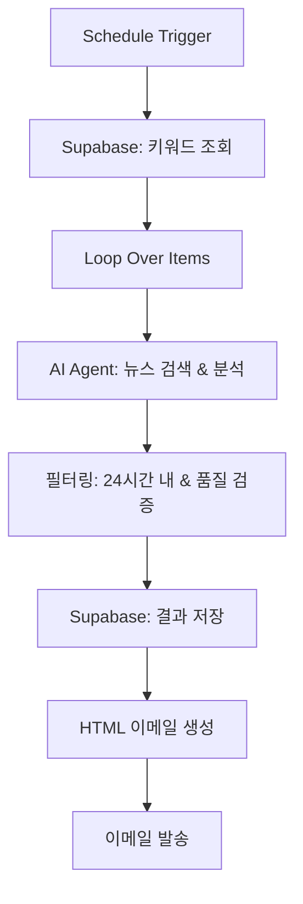

# N8N NAVER 기사 검색 자동화 워크플로우

> 네이버 뉴스 API와 AI를 활용한 스마트 뉴스 모니터링 시스템

## 🚀 Features

- **자동화된 뉴스 검색**: 매일 정해진 시간에 자동으로 뉴스 검색 실행
- **AI 기반 필터링**: 관련성 없는 기사 자동 제외 및 품질 검증
- **스마트 요약**: OpenAI GPT를 활용한 핵심 내용 요약
- **다중 채널 알림**: 이메일, 텔레그램, 디스코드 지원
- **데이터베이스 연동**: Supabase를 통한 검색 결과 저장 및 관리

## 📊 Architecture



## 🛠️ Setup

### Prerequisites

- N8N 워크플로우 환경
- OpenAI API 키
- 네이버 개발자 API 키 (Client ID & Secret)
- Supabase 프로젝트 설정
- SMTP 이메일 설정

### Required API Keys

```env
# OpenAI
OPENAI_API_KEY=your_openai_api_key

# 네이버 검색 API
NAVER_CLIENT_ID=your_naver_client_id
NAVER_CLIENT_SECRET=your_naver_client_secret

# Supabase
SUPABASE_URL=your_supabase_url
SUPABASE_ANON_KEY=your_supabase_anon_key
```

### Database Schema

#### `keyword_search_management_syu` 테이블
```sql
CREATE TABLE keyword_search_management_syu (
    id SERIAL PRIMARY KEY,
    registrant VARCHAR(50),
    keyword VARCHAR(100),
    include_phrases TEXT,
    exclude_phrases TEXT,
    created_at TIMESTAMP DEFAULT NOW()
);
```

#### `mailing_list_syu` 테이블
```sql
CREATE TABLE mailing_list_syu (
    id SERIAL PRIMARY KEY,
    email VARCHAR(255),
    use_YN CHAR(1) DEFAULT 'Y',
    created_at TIMESTAMP DEFAULT NOW()
);
```

#### `news_articles_syu` 테이블
```sql
CREATE TABLE news_articles_syu (
    id SERIAL PRIMARY KEY,
    keyword VARCHAR(100),
    article_title TEXT,
    query TEXT,
    ai_summary TEXT,
    source VARCHAR(100),
    published_at TIMESTAMP,
    link TEXT,
    date VARCHAR(8),
    created_at TIMESTAMP DEFAULT NOW()
);
```

## ⚙️ Configuration

### 1. AI Agent 설정

```javascript
// 검색 파라미터
keyword: "{{ $json.keyword }}"
include_phrases: "{{ $json.include_phrases }}"
exclude_phrases: "{{ $json.exclude_phrases }}"

// 필터링 조건
- 홍보성 기사 제외
- 24시간 이내 기사만 선별
- 실질적 기업 정보 포함 기사만 선택
```

### 2. 스케줄 트리거
- **실행 시간**: 매일 오전 8시
- **시간대**: 한국 표준시 (KST)

### 3. 이메일 템플릿
- 반응형 HTML 이메일 디자인
- 기사별 카드 형태 레이아웃
- 원클릭 기사 보기 링크

## 📈 Usage

### 키워드 등록
1. Supabase `keyword_search_management_syu` 테이블에 검색 키워드 등록
2. 포함할 단어(`include_phrases`)와 제외할 단어(`exclude_phrases`) 설정

### 메일링 리스트 관리
1. `mailing_list_syu` 테이블에서 수신자 이메일 관리
2. `use_YN` 필드로 활성/비활성 제어

### 수동 실행
N8N 워크플로우에서 "Execute Workflow" 버튼 클릭

## 🔍 AI 필터링 규칙

### ✅ 포함 대상
- 기업의 재무상태나 실적 정보
- 사업 확장 또는 축소 계획
- 투자 유치 또는 투자 계획
- 경영진 변경 또는 중요 인사
- 규제 이슈 또는 법적 문제
- M&A, 파트너십, 합병 관련 정보
- 중요 제품/서비스 출시

### ❌ 제외 대상
- 홍보성 기사, 보도자료
- 스포츠, 후원사업, 봉사활동
- 증권시황, 주가 관련 단순 언급
- 기업명만 부수적으로 언급된 기사

## 📧 Output Format

### 이메일 내용 구성
```html
📊 뉴스 검색 결과
├── 키워드: [검색어]
├── 검색 조건: (+포함어 -제외어)
├── 📰 기사 카드
│   ├── 제목 (링크)
│   ├── 📅 발행일시 | 📰 출처
│   ├── 🤖 AI 요약
│   └── 🔗 기사 전문 보기
└── 📈 총 N개 검색 결과
```

## 🔧 Troubleshooting

### 일반적인 문제

**Q: AI 요약이 "NO_RESULTS"로 나오는 경우**
- 검색 조건에 맞는 기사가 없거나 모든 기사가 필터링됨
- 키워드나 포함/제외 조건을 재검토 필요

**Q: 이메일이 발송되지 않는 경우**
- SMTP 설정 확인
- 메일링 리스트의 `use_YN` 필드가 'Y'인지 확인
- 이메일 주소 형식 검증

**Q: 네이버 API 호출 실패**
- API 키 유효성 확인
- 일일 호출 한도 확인
- 네트워크 연결 상태 점검

## 📝 License

MIT License - 자유롭게 사용하고 수정하세요.

## 🤝 Contributing

1. Fork the repository
2. Create your feature branch (`git checkout -b feature/AmazingFeature`)
3. Commit your changes (`git commit -m 'Add some AmazingFeature'`)
4. Push to the branch (`git push origin feature/AmazingFeature`)
5. Open a Pull Request

## 📞 Support

이슈나 질문이 있으시면 GitHub Issues를 통해 문의해주세요.

---
⭐ 이 프로젝트가 도움이 되셨다면 스타를 눌러주세요!
