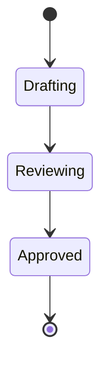

```markdown
# 📘 보고서 작성하기 강의 자료

본 문서는 **보조서 작성 과장 교육**을 위해 준비된 강의 자료입니다.  
GitHub 저장소에 업로드하여 교육 자료로 활용할 수 있습니다.

---

## 1. 보고서를 작성하기 위한 프롬프트 생성하기

효과적인 보고서 작성의 시작은 **프롬프트 설계**입니다.  
아래 3가지 방법을 통해 프롬프트를 만들고 활용할 수 있습니다.

### 가. Gemini 젬(Gem) 활용
- **Gemini AI의 Gem 기능**을 사용하면 반복 활용 가능한 프롬프트를 저장 가능  
- **실습 단계**:
  1. Gemini 계정 로그인 후 Gem 등록 페이지 접속
  2. 제공되는 예시 프롬프트 복사
  3. Gem으로 저장 후 테스트 실행  

**예시 프롬프트**:
```

당신은 전문 보고서 작성 보조자입니다.
사용자가 제공하는 데이터를 기반으로 목적, 구조, 요약을 포함한 보고서를 작성하세요.

```

---

### 나. OpenAI GPTs 활용
- OpenAI의 **Custom GPTs** 기능을 이용하여 프롬프트 등록 가능  
- 교육/보고용 GPT를 생성하면 반복 사용이 용이함  

**등록 절차**:
1. [OpenAI GPTs Builder](https://platform.openai.com/) 접속
2. "Create GPT" 선택
3. 제공되는 프롬프트를 입력 후 저장

**예시 프롬프트**:
```

역할: 금융 보고서 전문가
목표: 입력된 데이터와 주제를 바탕으로 구조적이고 간결한 보고서를 생성
조건: 반드시 도표·시각화를 제안할 것

````

---

### 다. 마스카라(Maskara) 프롬프트 생성기 활용
- **마스카라**는 다양한 스타일의 프롬프트를 조합하여 생성하는 툴  
- 보고서 목적(내부 보고 / 외부 발표 / 요약형 등)에 맞게 자동 생성  

**활용법**:
1. 주제 입력 → 톤/스타일 선택
2. 자동으로 프롬프트 템플릿 제공
3. 필요시 수정 후 저장

---

## 2. 생성된 보고서를 기반으로 보고서 추가 완성하기

프롬프트를 통해 초안 보고서를 생성한 후, 다양한 도구를 활용해 완성도를 높입니다.

### 가. [Mermaid Live](https://mermaid.live/) 활용 – 구조도 생성
- **Flowchart 예시**:
```mermaid
flowchart TD
    A[보고서 초안 작성] --> B[구조도 생성]
    B --> C[부장님 보고용 최종본 완성]
````

* **Sequence Diagram 예시**:

```mermaid
sequenceDiagram
    participant Staff as 과장
    participant Tool as AI 도구
    participant Boss as 부장님
    Staff->>Tool: 프롬프트 입력
    Tool-->>Staff: 보고서 초안 전달
    Staff->>Boss: 완성 보고서 제출
```

* **State Diagram 예시**:



---

### 나. [Napkin AI](https://www.napkin.ai/) 활용 – 시각화

* **텍스트 기반 데이터**를 자동으로 시각화
* 다양한 스타일 (타임라인, 인사이트 맵, 아이디어 클러스터 등) 제공

활용 예시:

* 보고서 요약을 인사이트 맵으로 변환
* 회의 주요 논점을 타임라인으로 표현

---

### 다. 부장님 눈에 맞는 보고서 작성

* **Tip 1:** 요약은 간결하게 (3\~5 bullet point)
* **Tip 2:** 핵심 수치/그래프 강조
* **Tip 3:** 의사결정 포인트는 굵은 글씨 처리
* **Tip 4:** “왜 중요한가?”를 반드시 포함

---

## 3. 파워포인트 발표자료 생성하기

### 가. [Marp Editor](https://demo.marpeditor.com/) 활용

* **Markdown 기반 → PPT 슬라이드 자동 생성**
* GitHub Pages와 연동하여 온라인에서도 발표 가능

**예시 슬라이드 코드**:

```markdown
---
marp: true
theme: default
paginate: true
---

# 📊 보고서 작성 강의

---

## 보고서 작성 단계
1. 프롬프트 설계
2. 초안 보고서 생성
3. 구조도/시각화 보강
4. 발표자료 제작
```

---

## ✅ 교육 포인트 정리

* **프롬프트 설계** → Gemini / GPTs / 마스카라
* **보고서 완성** → Mermaid / Napkin 활용
* **발표자료 제작** → Marp Editor로 슬라이드 변환
