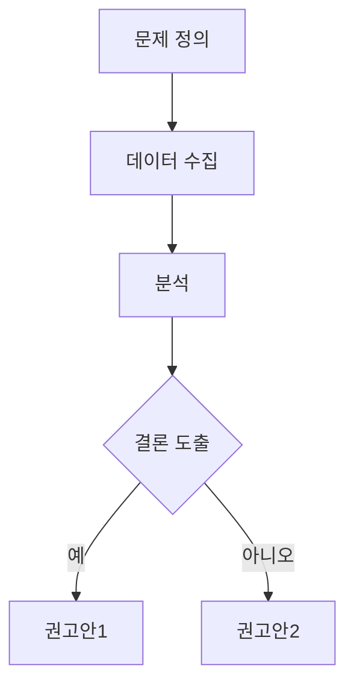
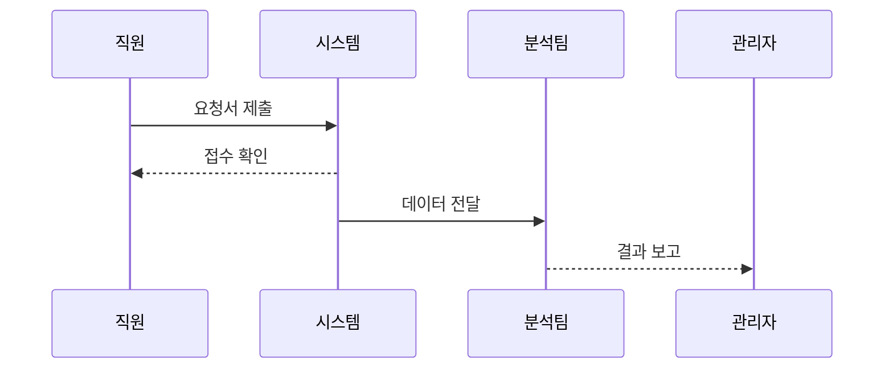
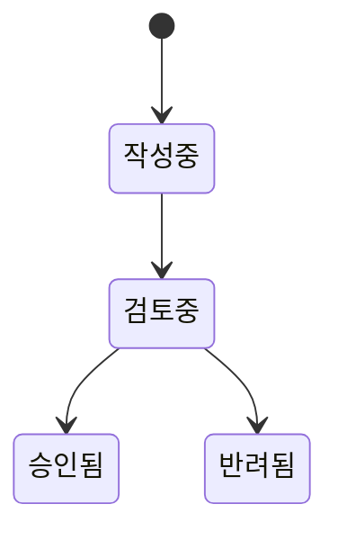

---
# 보고서 작성 응용

## 목적
- 보조서(보고서) 작성 과정을 교육하기 위한 가이드  
- 실무에서 바로 사용할 수 있는 프롬프트, 시각화 도구, 발표자료 생성 방법을 단계별로 설명  
- 대상: 팀 내 보고서 작성자(대리~과장), 보고서 품질 향상을 원하는 실무자

---

## 준비물(사전 준비)
- Gemini (또는 Google 계정)  
- OpenAI 계정 (또는 GPTs 등록 가능 계정)  
- mermaid.live — https://mermaid.live/  
- Napkin — https://www.napkin.ai/  
- Marp Editor — https://demo.marpeditor.com/ (또는 마크다운 → PPT 변환 도구)  
- (선택) Mascara 같은 프롬프트 설계 도구

---

## 교육 개요
1. 보고서를 작성하기 위한 프롬프트 생성하기 (2가지 예제 + Mascara 이용법)  
2. 생성된 보고서를 기반으로 보고서 완성하기 (구조도 및 시각화 포함)  
3. 파워포인트(슬라이드) 발표자료 생성하기 (Marp 사용 예)

---

# 1. 보고서를 작성하기 위한 프롬프트 생성하기
**목표:** 최소한의 입력으로도 쓸만한 보고서 초안을 얻을 수 있도록, 재사용 가능한 프롬프트 템플릿을 만듭니다.

### A. Gemini(젬) 사용 방법
- 사용처: Gemini Jam에 템플릿(Jam)으로 등록하여 반복 사용  
- 절차:
  1. Gemini 접속 → 새 Jam 생성  
  2. 아래 예제 프롬프트를 Jam에 템플릿으로 등록  
  3. 실제 데이터(배경, 목적, 핵심 결과, 수치)를 넣어 실행

예시 프롬프트 (Gemini Jam 등록용)
```text
[시스템]
당신은 기업 내 보고서 전문가입니다. 목적에 맞게 간결하고 명확한 보고서 초안을 작성하세요.

[사용자]
다음 정보를 바탕으로 보고서 초안을 작성해 주세요.
- 제목: {제목}
- 배경/상황: {배경}
- 목적: {목적}
- 핵심 결과/수치: {핵심결과}
- 권고안/다음 단계: {권고안}
출력 형식:
1) 요약(한 문장)
2) 핵심 내용(중요 항목별 소제목과 2~4줄 설명)
3) 권고안 및 다음 단계(번호 목록)
```

### B. OpenAI GPTs(또는 GPTs 등록) 사용 방법
- 사용처: OpenAI GPTs에 프롬프트를 등록해 조직 표준 템플릿으로 배포  
- 절차:
  1. OpenAI → GPTs → 새 GPT 생성  
  2. Persona/System Prompt에 템플릿 설정  
  3. 사용자가 입력할 필드(템플릿 변수) 안내

예시 프롬프트 (GPTs용)
```text
당신은 회사 내 보고서 작성 담당자입니다. 아래 정보를 간결하고 임원 보고용으로 재작성하세요.
입력값:
- 제목:
- 배경:
- 목적:
- 데이터 요약(숫자 포함):
- 결론/제안:

출력:
- Executive Summary(3~4문장)
- 핵심 결과(항목별, 각 항목 1-2문장)
- 권고안(우선순위 포함)
- 요약 표(가능하면 표 형태)
```

### C. Mascara(프롬프트 체인) 사용 방법
- 목적: 복잡한 보고서 생성을 단계별로 분해하여 일관성 있는 출력 확보  
- 방법(예시):
  1. Step 1: 입력 데이터 요약 (핵심 키워드 추출)  
  2. Step 2: 요약을 바탕으로 초안 작성(구조화)  
  3. Step 3: 스타일 및 길이 조정(임원용/현장용 선택)  
  4. Step 4: 최종 체크리스트(핵심 메시지 확인, 수치 검증)

예시 프롬프트 체인
- 프롬프트 A(요약): "주어진 텍스트에서 배경, 문제, 핵심결과 3개 항목으로 요약해줘."  
- 프롬프트 B(구조화): "요약 결과를 근거로 보고서 초안을 작성해줘. 제목/요약/상세/권고 형식."  
- 프롬프트 C(임원용): "초안을 임원용으로 간결하게 수정해줘. 핵심 메시지는 맨 앞에."

체크리스트(프롬프트 설계 시)
- [ ] 입력 항목(필수/선택) 명확화  
- [ ] 출력 형식(섹션, 길이) 정의  
- [ ] 예시 데이터를 넣어 테스트

---

# 2. 생성된 보고서를 기반으로 보고서 추가 완성하기
**목표:** 텍스트 보고서를 시각화와 구조도로 보완하여 이해도를 높입니다.

### A. mermaid.live을 이용한 구조도 생성
- 사이트: https://mermaid.live/  
- 사용 예: Flowchart, Sequence, State diagrams  
- 사용 방법:
  1. mermaid.live 접속  
  2. 좌측에 코드 입력 → 우측 미리보기 확인  
  3. 생성된 이미지를 보고서에 삽입

예시 코드 — Flowchart


예시 코드 — Sequence


예시 코드 — State


팁:
- 복잡한 프로세스는 Flowchart, 시간/순서 중심은 Sequence, 상태 변화는 State 다이어그램 사용  
- mermaid 코드를 README나 보고서에 코드 블록으로 포함하면 자동 렌더링되는 환경에서 편리

---

### B. Napkin.ai를 이용한 시각화
- 사이트: https://www.napkin.ai/  
- 특징: 텍스트 기반 시각화 생성, 다양한 스타일(아이콘/도해/도식)  
- 사용 방법:
  1. 사이트 접속 → 새 캔버스 생성  
  2. 텍스트로 핵심 메시지 입력(예: "월별 매출 추세와 주요 원인")  
  3. 스타일(차트/모형/아이콘) 선택 → 자동 생성된 시각화 편집

활용 팁:
- 슬라이드용 이미지(해상도 높게)로 추출  
- 복잡한 데이터는 요약 문장과 수치 첨부 후 시각화 요청

예시 입력 문장:
> "이번 분기 매출은 전분기 대비 12% 증가, 마케팅 캠페인A가 주요 요인으로 작용 — 매출 추세와 원인 도식으로 보여줘."

---

### C. 부장님 눈에 맞는 보고서 작성법 (임원용)
**핵심 원칙**
- 한눈에 핵심을 파악할 수 있도록 구성  
- 결론(요약) → 근거(핵심 수치) → 권고(우선순위) 순으로 제시  
- 가독성 높은 레이아웃(짧은 문장, 굵은 키워드, 표/그래프 활용)

**구성 템플릿 (임원용, 1페이지 권장)**  
1. 제목 & 작성일자  
2. Executive Summary (1~3문장)  
3. 핵심 지표(숫자, 전년/전월 비교)  
4. 문제/원인 요약(3개 이내)  
5. 권고사항(우선순위 부여, 1~3개)  
6. 필요 자원/리스크(한 줄 요약)  
7. 부록(자세한 데이터/분석 결과 — 필요 시 첨부)

문체 팁:
- 직접적이고 확실한 표현 사용 ("해야 합니다", "권고합니다")  
- 불확실성은 수치로 제시 ("확률 x%", "범위 y~z")

---

# 3. 파워포인트 발표자료 생성하기
**목표:** 보고서 내용을 발표용 슬라이드로 빠르게 변환

### A. Marp(마프) 에디터 활용
- 사이트: https://demo.marpeditor.com/  
- 특징: Markdown으로 슬라이드 작성 → HTML/PDF/PPTX로 변환 가능  
- 절차:
  1. Marp 에디터 접속  
  2. 아래 샘플 마크다운 붙여넣기  
  3. Export → PDF/PPTX 선택

## 샘플 Marp 마크다운 템플릿
```markdown
---
marp: true
theme: default
paginate: true
---

# 프로젝트 보고서

**제목:** {제목}  
**작성자:** {작성자}  
**작성일:** {작성일}

---

## Executive Summary

* 핵심 1
* 핵심 2
* 권고사항(요약)

---

## 주요 지표

* 매출: {금액} (전월대비 {증감}%)
* 사용자: {수치}

---

## 결론 및 제안

1. 우선 조치
2. 중장기 계획

---

## Appendix

* 데이터 표 및 세부 분석
```

### B. Marp용 생성 보조 프롬프트 예시
```text
아래 보고서 내용을 바탕으로 6~8슬라이드 분량의 Marp 마크다운을 생성해줘.

- 제목: {제목}
- 핵심 요약: {요약}
- 주요 지표: {지표목록}
- 권고안: {권고안}

각 슬라이드는 제목과 핵심 메시지(한두 문장)로 구성하고, 필요한 경우 도표 자리표시(예: [그래프 삽입])를 표기해줘.
```

팁:
- 슬라이드마다 한 가지 메시지(한 문장)를 유지  
- 시각 자료는 별도 이미지(mermaid/napkin)로 생성 후 삽입  
- 발표자 노트(핵심 멘트)는 슬라이드 하단 또는 별도 파일로 준비

---

## 권장 워크플로(예시)
1. 데이터/정보 수집  
2. Gemini/GPTs로 초안 생성  
3. Mascara(또는 단계별 프롬프트)로 내용 보강  
4. mermaid/napkin으로 시각화 생성  
5. Marp로 슬라이드 생성 및 최종 편집  
6. 내부 리뷰(동료/부장님 스타일 검토) → 최종 제출

체크리스트
- [ ] 초안에 핵심 메시지 명확히 포함  
- [ ] 핵심 수치(표/그래프) 삽입  
- [ ] 임원용 1페이지 요약 작성  
- [ ] 슬라이드(6~8장)로 발표자료 변환  
- [ ] 검토 피드백 반영 및 최종 제출

---

## 예시 프롬프트 정리(요약)
1. Gemini 템플릿: 보고서 초안 자동 생성(요약/구조화/권고 포함)  
2. GPTs 템플릿: 조직 표준 보고서 생성(임원용/상세용 옵션)  
3. Mascara 체인: 요약 → 구조화 → 스타일 적용(단계별 보정)

---

## 참고 링크
- mermaid.live: https://mermaid.live/  
- Napkin: https://www.napkin.ai/  
- Marp Editor: https://demo.marpeditor.com/
