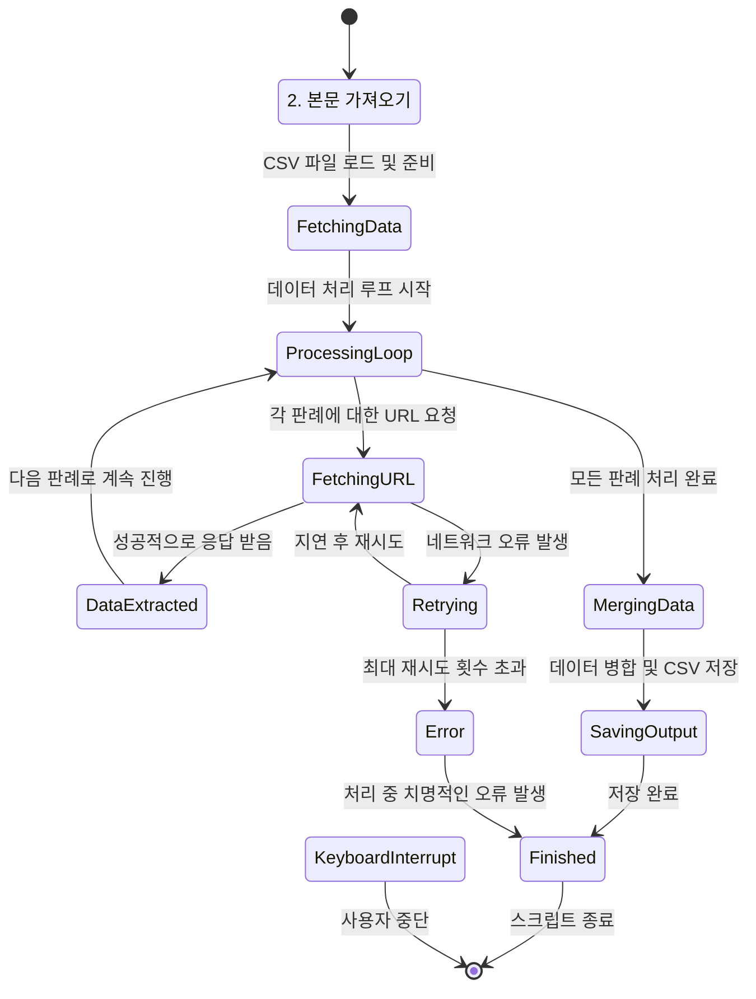
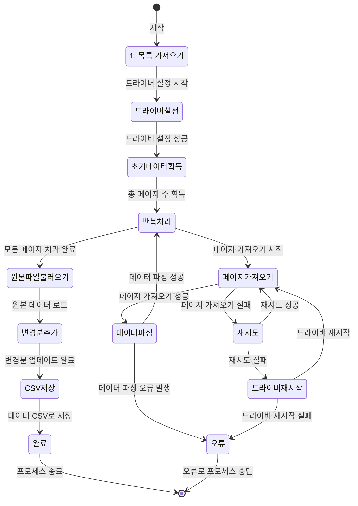
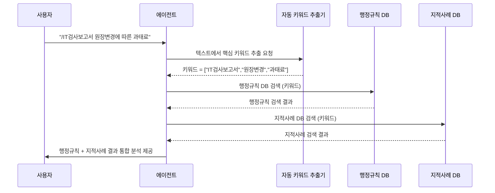
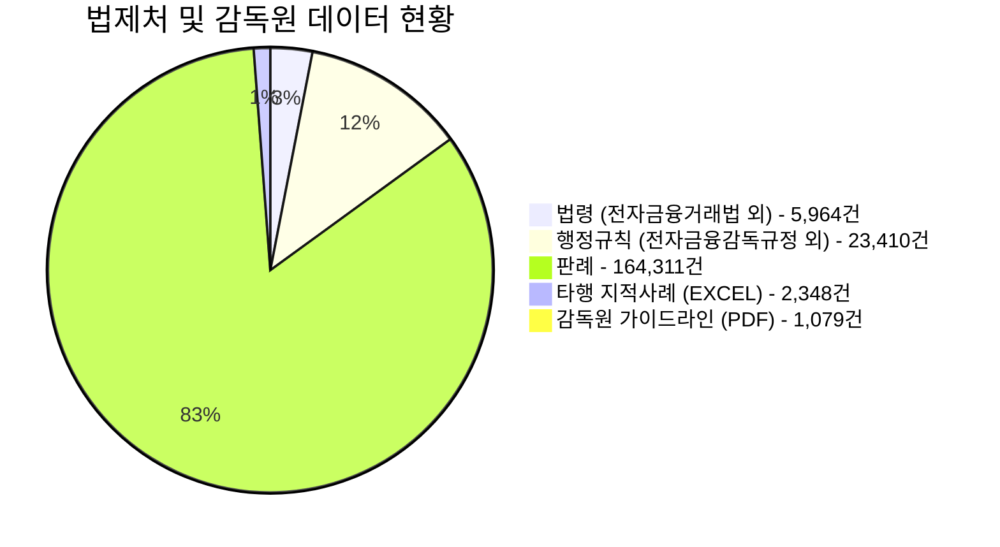
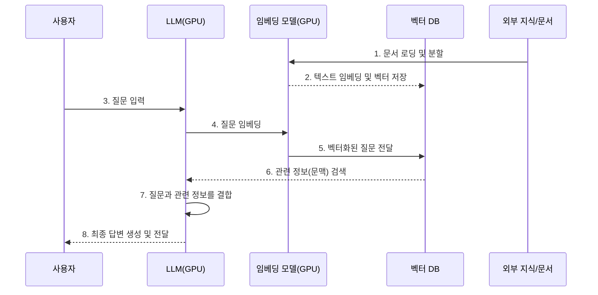
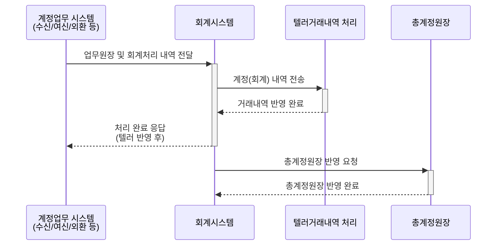
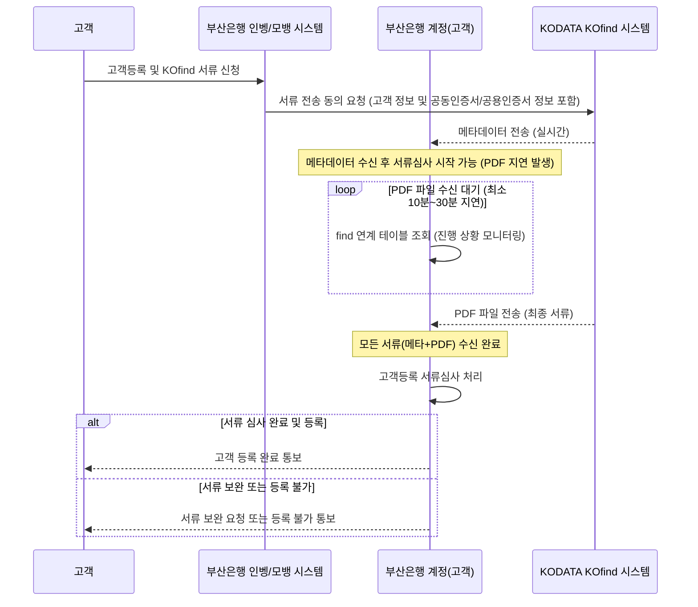
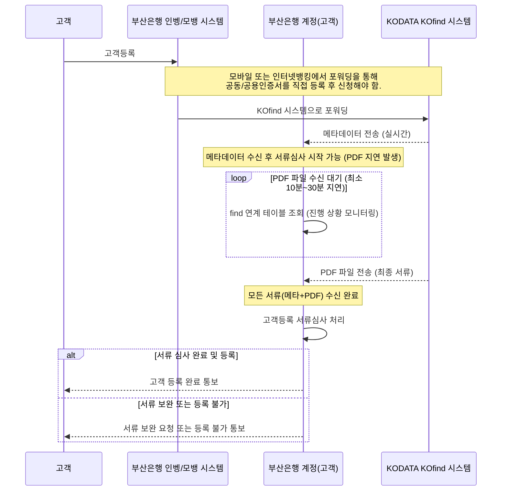
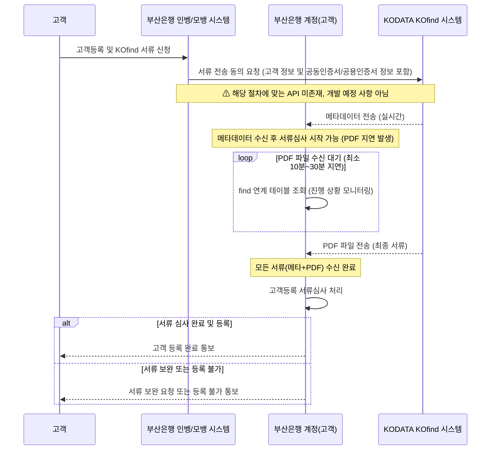
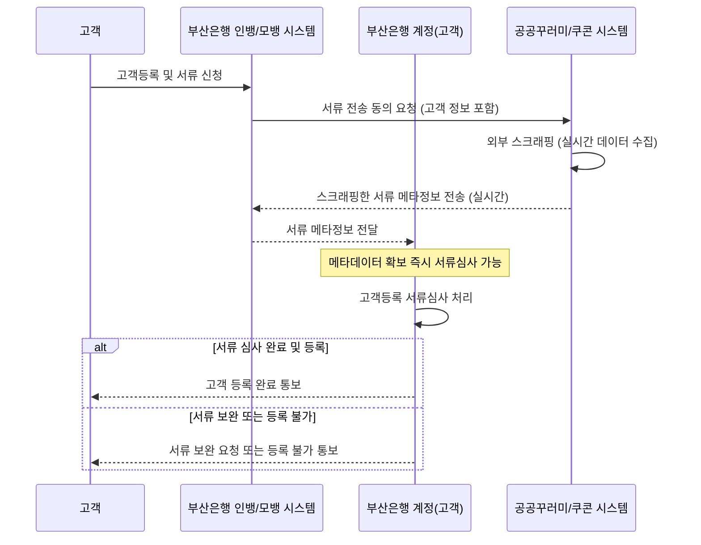

```mermaid
stateDiagram-v2
    direction TB
    state "2. 본문 가져오기" as getMainContent
    [*] --> getMainContent
    getMainContent --> FetchingData: CSV 파일 로드 및 준비
    FetchingData --> ProcessingLoop: 데이터 처리 루프 시작
    ProcessingLoop --> FetchingURL: 각 판례에 대한 URL 요청
    FetchingURL --> DataExtracted: 성공적으로 응답 받음
    FetchingURL --> Retrying: 네트워크 오류 발생
    Retrying --> FetchingURL: 지연 후 재시도
    Retrying --> Error: 최대 재시도 횟수 초과
    DataExtracted --> ProcessingLoop: 다음 판례로 계속 진행
    ProcessingLoop --> MergingData: 모든 판례 처리 완료
    MergingData --> SavingOutput: 데이터 병합 및 CSV 저장
    SavingOutput --> Finished: 저장 완료
    Error --> Finished: 처리 중 치명적인 오류 발생
    Finished --> [*]: 스크립트 종료
    KeyboardInterrupt --> [*]: 사용자 중단

```

```mermaid
stateDiagram-v2
    direction TB
    state "1. 목록 가져오기" as getList
    [*] --> getList: 시작
    getList --> 드라이버설정: 드라이버 설정 시작
    드라이버설정 --> 초기데이터획득: 드라이버 설정 성공
    초기데이터획득 --> 반복처리: 총 페이지 수 획득
    반복처리 --> 페이지가져오기: 페이지 가져오기 시작
    페이지가져오기 --> 데이터파싱: 페이지 가져오기 성공
    데이터파싱 --> 반복처리: 데이터 파싱 성공
    페이지가져오기 --> 재시도: 페이지 가져오기 실패
    재시도 --> 페이지가져오기: 재시도 성공
    재시도 --> 드라이버재시작: 재시도 실패
    드라이버재시작 --> 페이지가져오기: 드라이버 재시작
    반복처리 --> 원본파일불러오기: 모든 페이지 처리 완료
    원본파일불러오기 --> 변경분추가: 원본 데이터 로드
    변경분추가 --> CSV저장: 변경분 업데이트 완료
    CSV저장 --> 완료: 데이터 CSV로 저장
    완료 --> [*]: 프로세스 종료
    데이터파싱 --> 오류: 데이터 파싱 오류 발생
    오류 --> [*]: 오류로 프로세스 중단
    드라이버재시작 --> 오류: 드라이버 재시작 실패

```    

```mermaid
sequenceDiagram
    participant User as 사용자
    participant Agent as 에이전트
    participant Keyword as 자동 키워드 추출기
    participant RuleDB as 행정규칙 DB
    participant CaseDB as 지적사례 DB

    User->>Agent: "/IT검사보고서 원장변경에 따른 과태료"
    Agent->>Keyword: 텍스트에서 핵심 키워드 추출 요청
    Keyword-->>Agent: 키워드 = ["IT검사보고서","원장변경","과태료"]

    Agent->>RuleDB: 행정규칙 DB 검색 (키워드)
    RuleDB-->>Agent: 행정규칙 검색 결과

    Agent->>CaseDB: 지적사례 DB 검색 (키워드)
    CaseDB-->>Agent: 지적사례 검색 결과

    Agent->>User: 행정규칙 + 지적사례 결과 통합 분석 제공


```

```mermaid
pie title 법제처 및 감독원 데이터 현황
    "법령 (전자금융거래법 외) - 5,964건" : 5964
    "행정규칙 (전자금융감독규정 외) - 23,410건" : 23410
    "판례 - 164,311건" : 164311
    "타행 지적사례 (EXCEL) - 2,348건" : 2348
    "감독원 가이드라인 (PDF) - 1,079건" : 1079
```

```mermaid
sequenceDiagram
    participant User as 사용자
    participant LLM as LLM(GPU)
    participant EmbeddingModel as 임베딩 모델(GPU)
    participant VectorDB as 벡터 DB
    participant Corpus as 외부 지식/문서

    %% Pre-processing (사전 준비)
    Corpus ->> EmbeddingModel: 1. 문서 로딩 및 분할
    EmbeddingModel -->> VectorDB: 2. 텍스트 임베딩 및 벡터 저장

    %% RAG Process (RAG 작동 과정)
    User ->> LLM: 3. 질문 입력
    LLM ->> EmbeddingModel: 4. 질문 임베딩
    EmbeddingModel ->> VectorDB: 5. 벡터화된 질문 전달
    VectorDB -->> LLM: 6. 관련 정보(문맥) 검색
    LLM ->> LLM: 7. 질문과 관련 정보를 결합
    LLM -->> User: 8. 최종 답변 생성 및 전달
```

```mermaid
sequenceDiagram
    participant 고객업무시스템 as 계정업무 시스템<br/>(수신/여신/외환 등)
    participant 회계시스템 as 회계시스템
    participant 텔러시스템 as 텔러거래내역 처리
    participant 총계정원장 as 총계정원장

    고객업무시스템->>+회계시스템: 업무원장 및 회계처리 내역 전달

    회계시스템->>+텔러시스템: 계정(회계) 내역 전송
    텔러시스템-->>-회계시스템: 거래내역 반영 완료

    회계시스템-->>-고객업무시스템: 처리 완료 응답<br/>(텔러 반영 후)

    회계시스템->>+총계정원장: 총계정원장 반영 요청
    총계정원장-->>-회계시스템: 총계정원장 반영 완료
```

## case 1 

```mermaid
sequenceDiagram
    participant 고객
    participant 부산은행 인벵/모뱅 시스템
    participant 부산은행 계정(고객)
    participant KODATA KOfind 시스템

    고객->>부산은행 인벵/모뱅 시스템: 고객등록 및 KOfind 서류 신청
    부산은행 인벵/모뱅 시스템->>KODATA KOfind 시스템: 서류 전송 동의 요청 (고객 정보 및 공동인증서/공용인증서 정보 포함)
    KODATA KOfind 시스템-->>부산은행 계정(고객): 메타데이터 전송 (실시간)
    Note over 부산은행 계정(고객): 메타데이터 수신 후 서류심사 시작 가능 (PDF 지연 발생)
    loop PDF 파일 수신 대기 (최소 10분~30분 지연)
        부산은행 계정(고객)->>부산은행 계정(고객): find 연계 테이블 조회 (진행 상황 모니터링)
    end
    KODATA KOfind 시스템-->>부산은행 계정(고객): PDF 파일 전송 (최종 서류)
    Note over 부산은행 계정(고객): 모든 서류(메타+PDF) 수신 완료
    부산은행 계정(고객)->>부산은행 계정(고객): 고객등록 서류심사 처리
    alt 서류 심사 완료 및 등록
        부산은행 계정(고객)-->>고객: 고객 등록 완료 통보
    else 서류 보완 또는 등록 불가
        부산은행 계정(고객)-->>고객: 서류 보완 요청 또는 등록 불가 통보
    end

```

## case 2 

```mermaid
sequenceDiagram
    participant 고객
    participant 부산은행 인벵/모뱅 시스템
    participant 부산은행 계정(고객)
    participant KODATA KOfind 시스템

    고객->>부산은행 인벵/모뱅 시스템: 고객등록 
    Note over 부산은행 인벵/모뱅 시스템, KODATA KOfind 시스템: 모바일 또는 인터넷뱅킹에서 포워딩을 통해<br>공동/공용인증서를 직접 등록 후 신청해야 함.
    부산은행 인벵/모뱅 시스템->>KODATA KOfind 시스템: KOfind 시스템으로 포워딩
    KODATA KOfind 시스템-->>부산은행 계정(고객): 메타데이터 전송 (실시간)
    Note over 부산은행 계정(고객): 메타데이터 수신 후 서류심사 시작 가능 (PDF 지연 발생)
    loop PDF 파일 수신 대기 (최소 10분~30분 지연)
        부산은행 계정(고객)->>부산은행 계정(고객): find 연계 테이블 조회 (진행 상황 모니터링)
    end
    KODATA KOfind 시스템-->>부산은행 계정(고객): PDF 파일 전송 (최종 서류)
    Note over 부산은행 계정(고객): 모든 서류(메타+PDF) 수신 완료
    부산은행 계정(고객)->>부산은행 계정(고객): 고객등록 서류심사 처리
    alt 서류 심사 완료 및 등록
        부산은행 계정(고객)-->>고객: 고객 등록 완료 통보
    else 서류 보완 또는 등록 불가
        부산은행 계정(고객)-->>고객: 서류 보완 요청 또는 등록 불가 통보
    end
```

## case 3 

```mermaid
sequenceDiagram
    participant 고객
    participant 부산은행 인벵/모뱅 시스템
    participant 부산은행 계정(고객)
    participant KODATA KOfind 시스템

    고객->>부산은행 인벵/모뱅 시스템: 고객등록 및 KOfind 서류 신청
    부산은행 인벵/모뱅 시스템->>KODATA KOfind 시스템: 서류 전송 동의 요청 (고객 정보 및 공동인증서/공용인증서 정보 포함)
    Note over 부산은행 인벵/모뱅 시스템,KODATA KOfind 시스템: ⚠ 해당 절차에 맞는 API 미존재, 개발 예정 사항 아님
    KODATA KOfind 시스템-->>부산은행 계정(고객): 메타데이터 전송 (실시간)
    Note over 부산은행 계정(고객): 메타데이터 수신 후 서류심사 시작 가능 (PDF 지연 발생)
    loop PDF 파일 수신 대기 (최소 10분~30분 지연)
        부산은행 계정(고객)->>부산은행 계정(고객): find 연계 테이블 조회 (진행 상황 모니터링)
    end
    KODATA KOfind 시스템-->>부산은행 계정(고객): PDF 파일 전송 (최종 서류)
    Note over 부산은행 계정(고객): 모든 서류(메타+PDF) 수신 완료
    부산은행 계정(고객)->>부산은행 계정(고객): 고객등록 서류심사 처리
    alt 서류 심사 완료 및 등록
        부산은행 계정(고객)-->>고객: 고객 등록 완료 통보
    else 서류 보완 또는 등록 불가
        부산은행 계정(고객)-->>고객: 서류 보완 요청 또는 등록 불가 통보
    end

```

## case 4 

```mermaid
sequenceDiagram
    participant 고객
    participant 부산은행 인뱅/모뱅 시스템
    participant 부산은행 계정(고객)
    participant 공공꾸러미/쿠콘 시스템

    고객->>부산은행 인뱅/모뱅 시스템: 고객등록 및 서류 신청
    부산은행 인뱅/모뱅 시스템->>공공꾸러미/쿠콘 시스템: 서류 전송 동의 요청 (고객 정보 포함)
    공공꾸러미/쿠콘 시스템->>공공꾸러미/쿠콘 시스템: 외부 스크래핑 (실시간 데이터 수집)
    공공꾸러미/쿠콘 시스템-->>부산은행 인뱅/모뱅 시스템: 스크래핑한 서류 메타정보 전송 (실시간)
    부산은행 인뱅/모뱅 시스템-->>부산은행 계정(고객): 서류 메타정보 전달
    Note over 부산은행 계정(고객): 메타데이터 확보 즉시 서류심사 가능
    부산은행 계정(고객)->>부산은행 계정(고객): 고객등록 서류심사 처리
    alt 서류 심사 완료 및 등록
        부산은행 계정(고객)-->>고객: 고객 등록 완료 통보
    else 서류 보완 또는 등록 불가
        부산은행 계정(고객)-->>고객: 서류 보완 요청 또는 등록 불가 통보
    end


```
